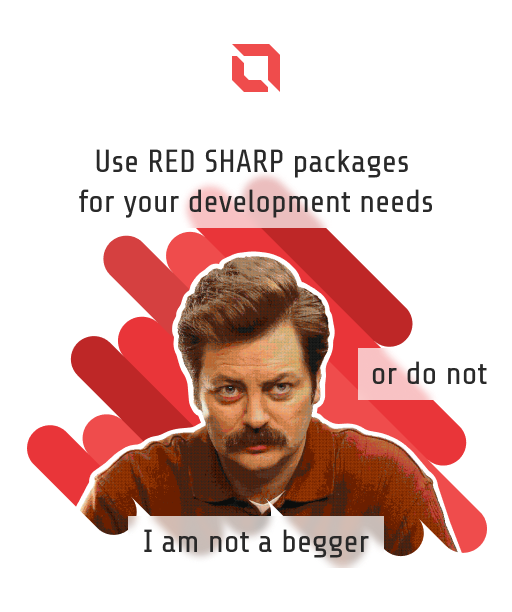

# Red Sharp MVVM Packages

Look, it is a simple, plain solution. I am not trying to hide something under `private` or `internal` without an absolute need, it doesn't contain auto-generators, that make code behind curtains, or any other fancy stuff, it probably has analogs and maybe they even better.

If you like to use the packages or source code, [you are welcome to do it](LICENSE). If my code helps someones to solve their tasks - it was all worth it.

       

## General MVVM library

**RedSharp.Mvvm package**

  

>The package is available for `.Net Framework`, `.Net Standard` and `.Net Core`.

## MVVM Bindings library

**RedSharp.Mvvm.Bindings package**

  

>The package is available for `.Net Framework`, `.Net Standard` and `.Net Core`.

## Observable collections library

**RedSharp.Mvvm.Collections package**

  

>The package is available for `.Net Framework`, `.Net Standard` and `.Net Core`.

## MVVM validation functionality library

**RedSharp.Mvvm.Validation package**

  

>The package is available for `.Net Framework`, `.Net Standard` and `.Net Core`.

